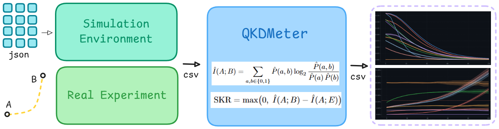

# QKDMeter: Análisis de rendimiento de QKD

## Descripción general

QKDMeter es una herramienta versátil para el análisis y simulación de protocolos de Distribución Cuántica de Claves (QKD), especialmente BB84, en escenarios industriales y de laboratorio. Permite evaluar el rendimiento de sistemas QKD simulados o reales, calcular métricas clave (QBER, SKR, absorción) y visualizar resultados de manera clara y reproducible.

## Flujo de trabajo



El flujo de trabajo estándar consta de tres notebooks principales:

### 1. NB1_Simulacion_Escenarios.ipynb
- **Función:** Simula la transmisión cuántica en diferentes escenarios definidos por archivos JSON (canal, ataque, detector, etc.).
- **Entrada:** Archivos JSON en la carpeta `scenarios/` que describen cada escenario.
- **Salida:** Un archivo CSV por escenario en `output_csv/` con los bits generados, detectados y, si aplica, interceptados por Eve.
- **Personalización:** Puedes modificar los parámetros de los escenarios editando los archivos JSON o añadir nuevos escenarios.

### 2. NB2_QKDMeter.ipynb
- **Función:** Calcula métricas de rendimiento (QBER, absorción, SKR) a partir de los CSV generados en el paso anterior.
- **Entrada:** Archivos CSV en `output_csv/`.
- **Salida:** Archivos CSV de métricas en `output_metrics/` con medias y desviaciones estándar por distancia y semilla.
- **Personalización:** Puedes filtrar distancias, semillas o incluso cargar tus propios CSV experimentales.

### 3. NB3_Plots.ipynb
- **Función:** Visualiza las métricas calculadas, generando gráficos comparativos entre escenarios y métricas.
- **Entrada:** Archivos de métricas en `output_metrics/`.
- **Salida:** Gráficos en pantalla y archivos PNG en `output_plots/`.
- **Personalización:** Puedes modificar estilos, colores, o agregar nuevas visualizaciones fácilmente.

## Versatilidad y personalización

- **Escenarios simulados:** Puedes definir cualquier número de escenarios modificando o añadiendo archivos JSON en `scenarios/`.
- **Datos experimentales reales:** Si tienes datos reales de experimentos QKD, puedes crear un CSV con el formato esperado (`distancia`, `experimento`, `n_bit`, `bit_alice`, `bit_eve`, `bit_bob`) y colocarlo en `output_csv/`. El flujo de métricas y visualización funcionará igual.
- **Filtros y análisis:** Los notebooks permiten filtrar por distancias, semillas, o analizar subconjuntos específicos de datos.
- **Extensión:** Puedes añadir nuevas métricas, modificar funciones de análisis o crear nuevos tipos de gráficos según tus necesidades.

## Requisitos

- Python 3.10+
- numpy, pandas, matplotlib

Instala dependencias con:
```
pip install -r requirements.txt
```

## Estructura del repositorio

- `NB1_Simulacion_Escenarios.ipynb`: Simulación de escenarios QKD.
- `NB2_QKDMeter.ipynb`: Cálculo de métricas de rendimiento.
- `NB3_Plots.ipynb`: Visualización de resultados.
- `scenarios/`: Archivos JSON con parámetros de escenarios.
- `output_csv/`: Resultados de simulaciones (o datos experimentales).
- `output_metrics/`: Métricas calculadas.
- `output_plots/`: Gráficos generados.
- `Figures/`: Imágenes y diagramas.

## Ejemplo de uso con datos reales

1. Coloca tu CSV experimental en `output_csv/` siguiendo el formato estándar.
2. Ejecuta `NB2_QKDMeter.ipynb` para calcular métricas sobre tus datos.
3. Visualiza los resultados en `NB3_Plots.ipynb`.
